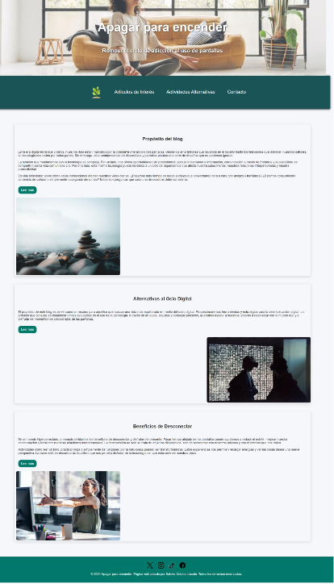
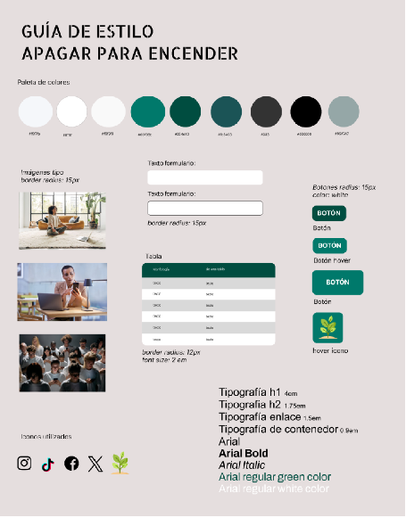

# Apagar para encender

## Descripción del Proyecto

"Apagar para encender" es un blog dedicado a ayudar a las personas a encontrar un equilibrio saludable en su uso de la tecnología. En un mundo donde las pantallas dominan nuestra vida diaria, este blog ofrece consejos, artículos y actividades alternativas para reducir la dependencia de los dispositivos digitales y reconectar con el mundo real.

El blog está estructurado en varias secciones:

- **Página Principal (`index.html`)**: Presenta el propósito del blog, artículos destacados y reflexiones sobre la adicción a las pantallas.
- **Artículos de Interés (`grid.html`)**: Una colección de artículos y recursos para profundizar en el tema.
- **Actividades Alternativas (`tabla.html`)**: Una lista de actividades que pueden realizarse en lugar de pasar tiempo frente a las pantallas.
- **Formulario de Contacto (`form.html`)**: Un espacio para que los lectores se pongan en contacto con el autor del blog.

---

## Capturas de Pantalla

### Página Principal (`index.html`)

### Guía de Estilos

---
## Autor
Este proyecto fue creado por Sabela Cobelo Losada.

## Licencia
Este proyecto está bajo la licencia MIT. Para más detalles, consulta el archivo LICENSE.

¡Gracias por visitar "Apagar para encender"! Esperamos que encuentres útiles los recursos y consejos proporcionados aquí.

